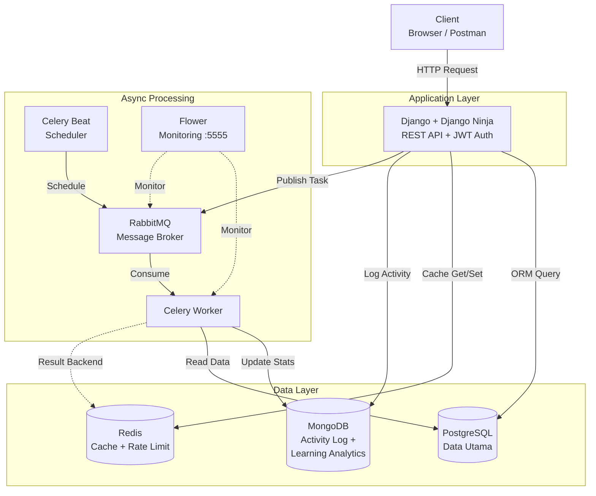
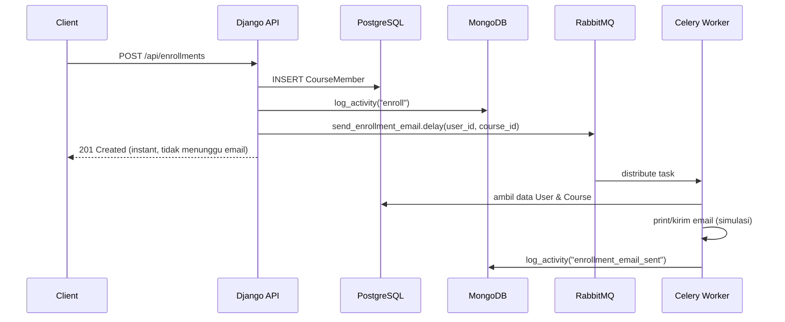
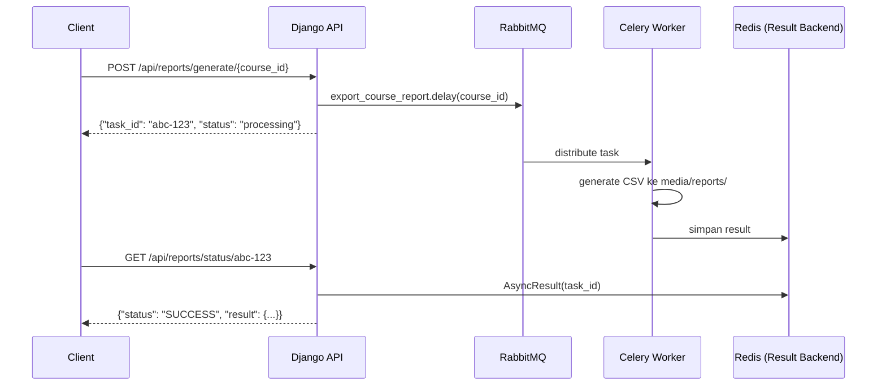

# Simple LMS — Django + Redis + MongoDB + Celery + RabbitMQ

Backend Simple LMS dengan REST API (Django Ninja), JWT auth, Redis caching,
MongoDB analytics, dan async task processing via Celery + RabbitMQ.

---

## Arsitektur Sistem



---

## Cara Menjalankan Project

**1. Clone repository**
```bash
git clone https://github.com/muchlishamidi/Simple-LMS---Docker.git
cd simple-lms
```

**2. Buat file `.env`**
```bash
cp .env.example .env
```

**3. Jalankan semua services**
```bash
docker compose down -v
docker compose up --build
```

Services yang akan jalan: `web`, `db` (PostgreSQL), `redis`, `mongodb`, `rabbitmq`, `celery-worker`, `celery-beat`, `flower`.

**4. Import data awal**
```bash
docker compose exec web python importer.py
```

**5. Buat superuser**
```bash
docker compose exec web python manage.py createsuperuser
```

**6. Buka browser**

| Service | URL |
|---|---|
| Django Admin | http://localhost:8000/admin/ |
| Swagger API Docs | http://localhost:8000/api/docs |
| Django Silk (query profiling) | http://localhost:8000/silk/ |
| Flower (Celery monitoring) | http://localhost:5555 |
| RabbitMQ Management | http://localhost:15672 (admin/password123) |

---

## Struktur Project

```
simple-lms/
├── Dockerfile
├── docker-compose.yml
├── .env.example
├── requirements.txt
├── manage.py
├── importer.py
├── config/
│   ├── settings.py      # Django + Redis + Mongo + Celery config
│   ├── celery.py         # Inisialisasi Celery app
│   ├── urls.py
│   └── wsgi.py
├── courses/
│   ├── models.py
│   ├── managers.py
│   ├── admin.py
│   ├── api.py            # Semua endpoint REST API
│   ├── schemas.py
│   ├── helpers.py        # Authorization helpers
│   ├── cache.py          # Redis caching + rate limiting
│   ├── serializers.py    # Course -> dict (untuk cache JSON)
│   ├── mongo_service.py  # Activity Log + Learning Analytics
│   ├── tasks.py          # 4 Celery tasks
│   ├── migrations/
│   └── fixtures/
├── scripts/
│   └── query_demo.py
├── media/
│   ├── certificates/     # Output generate_certificate
│   └── reports/          # Output export_course_report
└── postman/
    └── Simple_LMS_API.postman_collection.json
```

---

## 1. Redis Integration

### 1.1 Course List & Detail Caching

| Endpoint | Cache Key Pattern | TTL |
|---|---|---|
| `GET /api/courses` | `course:list:<md5_hash_query_params>` | 5 menit |
| `GET /api/courses/{id}` | `course:detail:<id>` | 10 menit |

**Mengapa MD5 hash untuk list cache key?** Endpoint list punya banyak kombinasi query parameter (`search`, `min_price`, `max_price`, `category_id`, `page`, `page_size`). Setiap kombinasi unik di-hash jadi satu key supaya tidak ada collision antar filter yang berbeda.

Implementasi raw `redis-py` (bukan Django cache framework) dipakai secara sengaja — supaya key di Redis bisa diperiksa langsung lewat `redis-cli` tanpa prefix/versioning tambahan yang ditambahkan Django secara otomatis.

### 1.2 Cache Invalidation Strategy

Setiap kali ada **create/update/delete** pada `Course`, `invalidate_course_cache()` dipanggil:
- Semua key `course:list:*` dihapus sekaligus (lewat `SCAN` + `DELETE`), karena jumlah variasi filter tidak terbatas sehingga tidak praktis melacak key satu-satu.
- Key `course:detail:<id>` milik course yang diubah dihapus secara spesifik.

```python
# courses/cache.py
def invalidate_course_cache(course_id=None):
    for key in _redis_cache.scan_iter("course:list:*"):
        _redis_cache.delete(key)
    if course_id is not None:
        _redis_cache.delete(f"course:detail:{course_id}")
```

### 1.3 Rate Limiting (60 request/menit)

Diterapkan pada endpoint publik `GET /api/courses` dan `GET /api/courses/{id}` — endpoint paling rawan diakses berlebihan karena tidak butuh login.

**Algoritma:** Fixed Window menggunakan `INCR` + `EXPIRE` Redis (atomik):

```python
key = f"ratelimit:{ip_address}"
current = redis.incr(key)
if current == 1:
    redis.expire(key, 60)          # window 60 detik
if current > 60:
    raise HttpError(429, "...")    # Too Many Requests
```

Identifier yang dipakai adalah **IP address** client (lewat header `X-Forwarded-For` atau `REMOTE_ADDR`), bukan user id, karena endpoint ini publik dan bisa diakses tanpa login.

### 1.4 Redis CLI Commands — Dokumentasi

```bash
# Masuk ke Redis CLI di dalam container
docker compose exec redis redis-cli

# Lihat semua key cache course list
KEYS course:list:*

# Lihat isi salah satu cache (JSON string)
GET course:detail:1

# Cek TTL (sisa waktu) sebuah key
TTL course:detail:1

# Lihat counter rate limit untuk satu IP (di DB 1)
SELECT 1
GET ratelimit:127.0.0.1
TTL ratelimit:127.0.0.1

# Hapus manual seluruh cache list (simulasi invalidation)
SELECT 0
KEYS course:list:*
FLUSHDB        # hapus semua key di DB aktif (hati-hati!)

# Monitor semua command yang masuk secara real-time
MONITOR
```

---

## 2. MongoDB Integration

Database: `lms_analytics` — dua collection utama:

### 2.1 Collection `activity_logs`
Mencatat setiap aksi user: `view_course`, `enroll`, `post_comment`, `enrollment_email_sent`, `certificate_generated`.

```json
{
  "user_id": 1,
  "action": "view_course",
  "target_type": "course",
  "target_id": 5,
  "metadata": { "course_name": "Pemrograman Web" },
  "timestamp": "2026-06-25T10:30:00Z"
}
```

### 2.2 Collection `learning_analytics`
Snapshot progres belajar per (user, course) — di-upsert setiap kali ada perubahan progress lewat `POST /enrollments/{id}/progress`.

```json
{
  "user_id": 1,
  "course_id": 5,
  "enrollment_id": 3,
  "progress_percentage": 66.67,
  "completed_content_ids": [1, 2],
  "last_accessed": "2026-06-25T10:30:00Z"
}
```

### 2.3 Aggregation Queries

| Fungsi | Pipeline | Endpoint |
|---|---|---|
| `get_popular_courses()` | `$match` → `$group` → `$addFields` → `$sort` → `$limit` | `GET /api/analytics/popular-courses` |
| `get_user_activity_summary()` | `$match` → `$group` (breakdown per action) | `GET /api/analytics/user-activity/{user_id}` |
| `get_daily_activity_summary()` | `$group` by tanggal → `$sort` → `$limit` | `GET /api/analytics/daily-summary` |
| `get_course_completion_stats()` | `$match` → `$group` (avg progress, completed count) | dipakai di `export_course_report` |

### 2.4 Cek manual via mongosh

```bash
docker compose exec mongodb mongosh -u admin -p password123

use lms_analytics
db.activity_logs.countDocuments()
db.activity_logs.find().sort({timestamp: -1}).limit(5)
db.learning_analytics.find()
```

---

## 3. Celery Async Tasks

| # | Task | Jenis | Trigger |
|---|---|---|---|
| 1 | `send_enrollment_email` | Async | Otomatis saat `POST /enrollments` |
| 2 | `generate_certificate` | Async | Otomatis saat progress course mencapai 100% (`POST /enrollments/{id}/progress`) |
| 3 | `update_course_statistics` | **Periodic** (Celery Beat) | Setiap 10 menit (`crontab(minute="*/10")`) |
| 4 | `export_course_report` | Async (manual trigger) | `POST /api/reports/generate/{course_id}` |

### Task Flow — Enrollment Email



### Task Flow — Generate Report (polling pattern)



### Menjalankan & Memantau Task Secara Manual

```bash
# Masuk ke Django shell di container web
docker compose exec web python manage.py shell

>>> from courses.tasks import send_enrollment_email
>>> result = send_enrollment_email.delay(1, 1)
>>> result.status   # 'PENDING' -> 'SUCCESS'
>>> result.result
```

```bash
# Lihat log Celery Worker secara real-time
docker compose logs -f celery-worker

# Lihat log Celery Beat (periodic scheduler)
docker compose logs -f celery-beat
```

---

## 4. Monitoring

### 4.1 Flower (Celery Monitoring)
Akses: **http://localhost:5555**

Fitur yang bisa dipantau:
- Daftar task: nama, status (PENDING/STARTED/SUCCESS/FAILURE), runtime
- Worker yang online beserta jumlah task yang diproses
- Grafik task rate secara real-time

### 4.2 RabbitMQ Management UI
Akses: **http://localhost:15672** (login: `admin` / `password123`)

Bisa dipakai untuk memantau jumlah pesan di queue, koneksi aktif dari Celery worker/beat, dan throughput exchange.

---

## API Endpoints — Ringkasan

### Auth
| Method | Endpoint | Auth |
|---|---|---|
| POST | `/api/auth/register` | - |
| POST | `/api/auth/sign-in` | - |
| POST | `/api/auth/token-refresh` | - |
| GET / PUT | `/api/auth/me` | Bearer |

### Courses (cached + rate-limited di GET)
| Method | Endpoint | Auth |
|---|---|---|
| GET | `/api/courses` | - (cache 5 menit, rate limit 60/menit) |
| GET | `/api/courses/{id}` | - (cache 10 menit, rate limit 60/menit) |
| POST | `/api/courses` | Bearer |
| PATCH | `/api/courses/{id}` | Bearer (owner) |
| DELETE | `/api/courses/{id}` | Bearer (owner/superadmin) |

### Enrollments
| Method | Endpoint | Auth | Efek samping |
|---|---|---|---|
| POST | `/api/enrollments` | Bearer | → `send_enrollment_email.delay()` |
| GET | `/api/enrollments/my-courses` | Bearer | - |
| POST | `/api/enrollments/{id}/progress` | Bearer | → Mongo `learning_analytics`, → `generate_certificate.delay()` jika 100% |

### Comments
| Method | Endpoint | Auth |
|---|---|---|
| POST | `/api/comments` | Bearer (harus enrolled) |
| PUT | `/api/comments/{id}` | Bearer (owner) |
| DELETE | `/api/comments/{id}` | Bearer (owner/course owner/superadmin) |

### Analytics (MongoDB, Admin only)
| Method | Endpoint |
|---|---|
| GET | `/api/analytics/popular-courses` |
| GET | `/api/analytics/user-activity/{user_id}` |
| GET | `/api/analytics/daily-summary` |

### Reports (Celery async)
| Method | Endpoint | Auth |
|---|---|---|
| POST | `/api/reports/generate/{course_id}` | Bearer (owner/admin) |
| GET | `/api/reports/status/{task_id}` | Bearer |

---

## Testing dengan Postman

Import `postman/Simple_LMS_API.postman_collection.json`. Urutan testing yang disarankan:
1. **Auth → Sign In** (token tersimpan otomatis)
2. **Courses → List Courses** — panggil 2x, perhatikan response kedua jauh lebih cepat (cache hit)
3. **Enrollments → Enroll to Course** — cek log `docker compose logs -f celery-worker` untuk melihat email terkirim
4. **Reports → Generate Course Report** lalu **Check Report Status** — demonstrasi polling pattern

---

## Environment Variables

| Variable | Keterangan |
|---|---|
| `SECRET_KEY` | Kunci enkripsi Django. |
| `DEBUG` / `ALLOWED_HOSTS` | Konfigurasi standar Django. |
| `POSTGRES_*` | Koneksi PostgreSQL. |
| `REDIS_HOST` / `REDIS_PORT` | Koneksi Redis. |
| `REDIS_CACHE_DB` | Redis DB index untuk course caching (default 0). |
| `REDIS_RATELIMIT_DB` | Redis DB index untuk rate limiting (default 1). |
| `MONGO_USER` / `MONGO_PASSWORD` / `MONGO_HOST` / `MONGO_PORT` / `MONGO_DB` | Koneksi MongoDB. |
| `RABBITMQ_USER` / `RABBITMQ_PASSWORD` | Kredensial RabbitMQ. |
| `CELERY_BROKER_URL` | AMQP URL ke RabbitMQ. |
| `CELERY_RESULT_BACKEND` | Redis DB untuk menyimpan hasil task (default DB 2). |

---

## Catatan & Batasan

- **Sertifikat** di-generate sebagai file `.txt` sederhana (bukan PDF), karena library PDF generation (mis. `reportlab`) di luar scope tugas ini.
- **Email** disimulasikan dengan `print()` di log Celery Worker, bukan SMTP nyata — silakan ganti `send_enrollment_email` dengan `django.core.mail.send_mail` untuk implementasi production.
- **Periodic task** `update_course_statistics` dijadwalkan setiap 10 menit untuk kebutuhan demo; untuk production sebaiknya diubah ke `crontab(hour=0, minute=0)` (sekali sehari) di `config/settings.py`.

---
