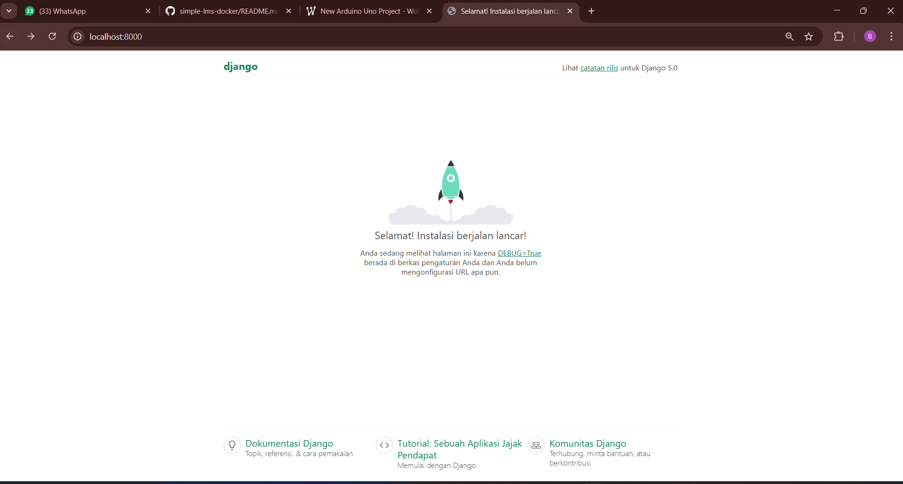

# Simple LMS — Django + Docker + PostgreSQL

## Cara Menjalankan Project

**1. Clone repository**
```bash
git clone https://github.com/muchlishamidi/Simple-LMS---Docker.git
cd Simple-LMS---Docker
```

**2. Buat file `.env`**
```bash
cp .env.example .env
```

**3. Jalankan Docker Compose**
```bash
docker compose up --build
```

**4. Buka browser**

Akses di http://localhost:8000

---

## Environment Variables

| Variable | Keterangan |
|---|---|
| `SECRET_KEY` | Kunci enkripsi Django. Wajib diganti di production. |
| `DEBUG` | `True` untuk development, `False` untuk production. |
| `ALLOWED_HOSTS` | Daftar host yang boleh mengakses aplikasi. |
| `POSTGRES_DB` | Nama database PostgreSQL. |
| `POSTGRES_USER` | Username database. |
| `POSTGRES_PASSWORD` | Password database. |
| `POSTGRES_HOST` | Hostname database. Isi `db` agar sesuai nama service di docker-compose. |
| `POSTGRES_PORT` | Port PostgreSQL, default `5432`. |
| `STATIC_URL` | URL prefix untuk mengakses static files. |
| `STATIC_ROOT` | Path tempat `collectstatic` menyimpan file. |

---

## Screenshot Django Welcome Page



---