# Simple LMS — Django + Docker + PostgreSQL

## Cara Menjalankan Project

**1. Clone repository**
```bash
git clone https://github.com/muchlishamidi/Simple-LMS---Docker.git
cd Simple-LMS---Docker
```

**2. Buat file `.env`**
```bash
cp .env.example .env
```

**3. Jalankan Docker Compose**
```bash
docker compose down -v
docker compose up --build
```

**4. Import data awal**
```bash
docker compose exec web python importer.py
```

**5. Buat superuser**
```bash
docker compose exec web python manage.py createsuperuser
```

**6. Buka browser**

- Django Admin : http://localhost:8000/admin/
- Django Silk  : http://localhost:8000/silk/

---

## Struktur Project

```
simple-lms/
├── Dockerfile
├── docker-compose.yml
├── .env.example
├── requirements.txt
├── manage.py
├── importer.py
├── config/
│   ├── settings.py
│   ├── urls.py
│   └── wsgi.py
├── courses/
│   ├── models.py
│   ├── managers.py
│   ├── admin.py
│   ├── migrations/
│   └── fixtures/
│       ├── courses.csv
│       └── members.csv
└── scripts/
    └── query_demo.py
```

---

## Data Models

| Model | Keterangan |
|---|---|
| User | Custom AbstractUser dengan role: admin, instructor, student |
| Category | Self-referencing untuk hierarki kategori |
| Course | Mata kuliah dengan relasi ke User (teacher) dan Category |
| CourseMember | Pendaftaran siswa ke course, unique per course-user |
| CourseContent | Konten/materi kelas dengan urutan (order) dan self-referencing |
| Comment | Komentar anggota kelas pada suatu konten |
| Progress | Tracking penyelesaian konten per anggota kelas |

---

## Model Managers

**`Course.objects.for_listing()`**
Mengambil semua course sekaligus dengan data teacher, category, jumlah konten, dan jumlah member menggunakan `select_related` dan `annotate` — tanpa N+1 problem.

**`CourseMember.objects.for_student_dashboard(user)`**
Mengambil semua course yang diikuti seorang student beserta data lengkap course dan progress-nya menggunakan `select_related` dan `prefetch_related`.

---

## Query Optimization Demo

```bash
docker compose exec web python scripts/query_demo.py
```

---

## Environment Variables

| Variable | Keterangan |
|---|---|
| `SECRET_KEY` | Kunci enkripsi Django. Wajib diganti di production. |
| `DEBUG` | `True` untuk development, `False` untuk production. |
| `ALLOWED_HOSTS` | Daftar host yang boleh mengakses aplikasi. |
| `POSTGRES_DB` | Nama database PostgreSQL. |
| `POSTGRES_USER` | Username database. |
| `POSTGRES_PASSWORD` | Password database. |
| `POSTGRES_HOST` | Hostname database. Isi `db` agar sesuai nama service di docker-compose. |
| `POSTGRES_PORT` | Port PostgreSQL, default `5432`. |
| `STATIC_URL` | URL prefix untuk mengakses static files. |
| `STATIC_ROOT` | Path tempat `collectstatic` menyimpan file. |

---

## Dokumentasi

### 1. Semua Model Terdaftar di Django Admin

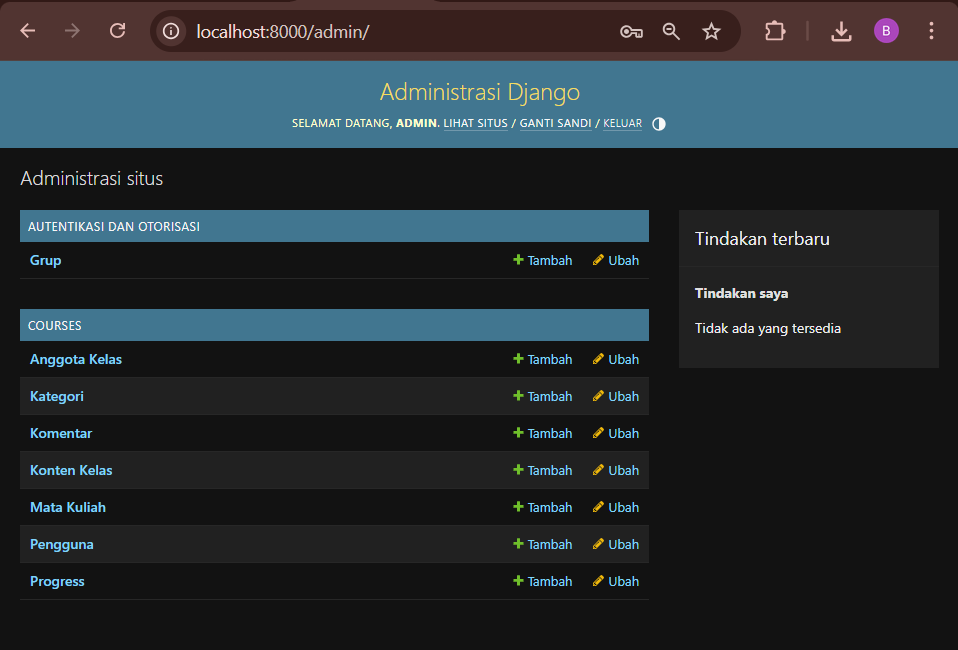

### 2. List Display dan Filter di Django Admin

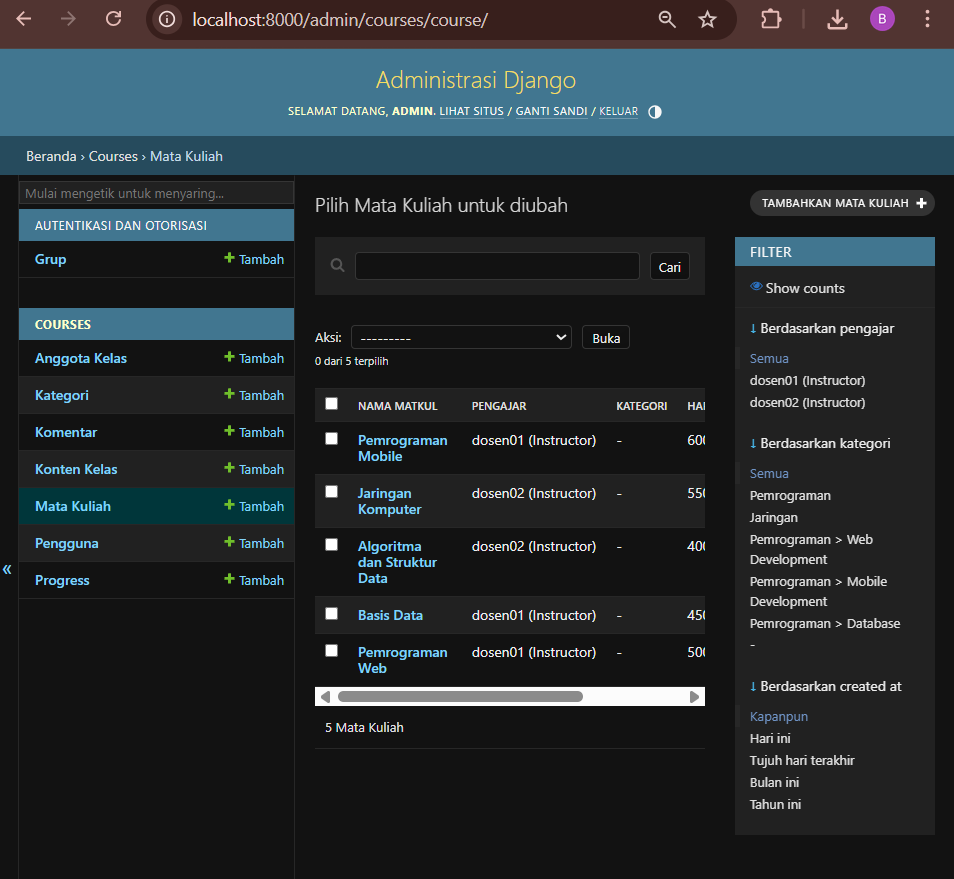

### 3. Inline CourseContent di Form Course

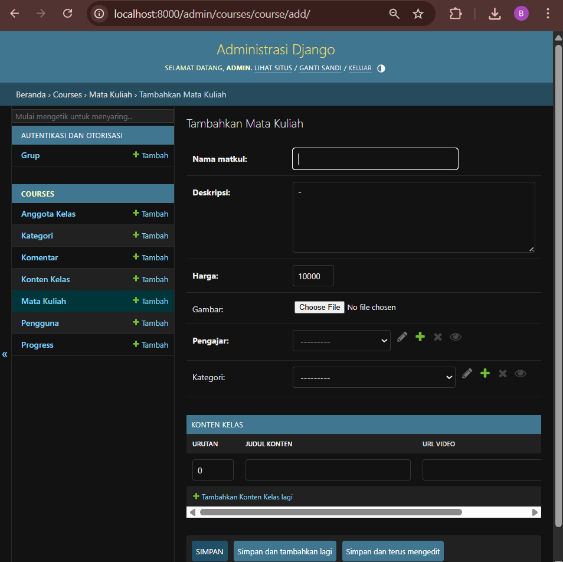

### 4. Migrasi Berhasil

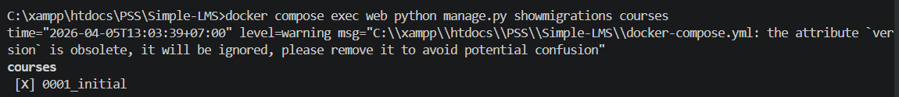

### 5. Import Data Berhasil

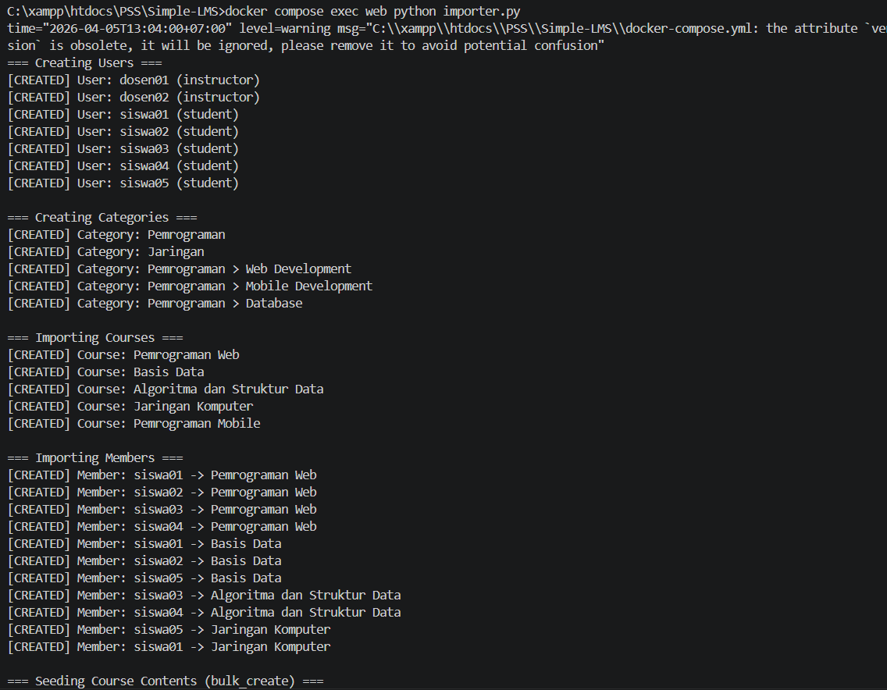

### 6. Data Hasil Import di Django Admin


### 7. Query Demo — Perbandingan N+1 vs Optimized

**Demo 1 — List course + teacher (N+1 vs select_related)**

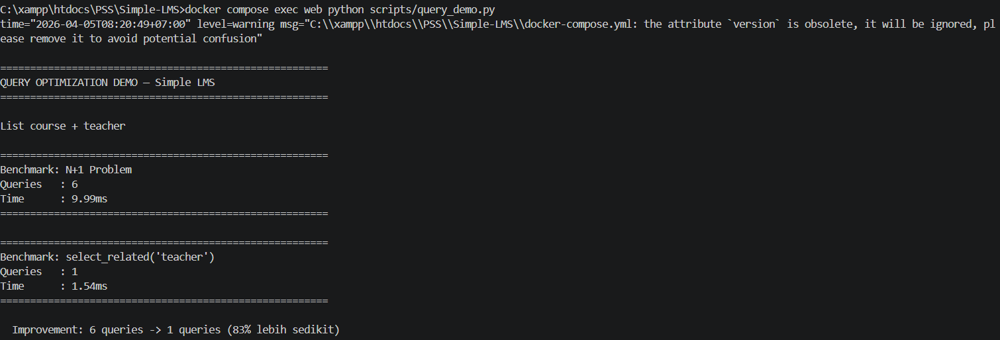

**Demo 2 — List course + jumlah member (N+1 vs annotate)**

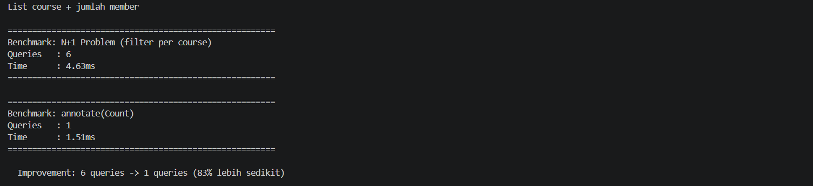

**Demo 3 — Course.objects.for_listing()**

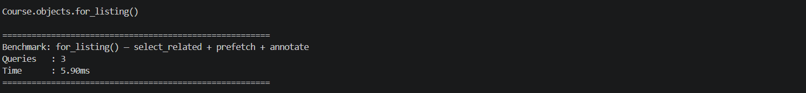

**Demo 4 — CourseMember.objects.for_student_dashboard()**

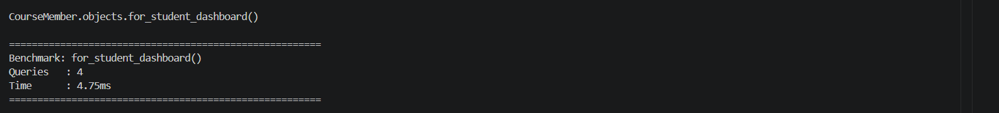

**Demo 5 — Aggregate statistik**

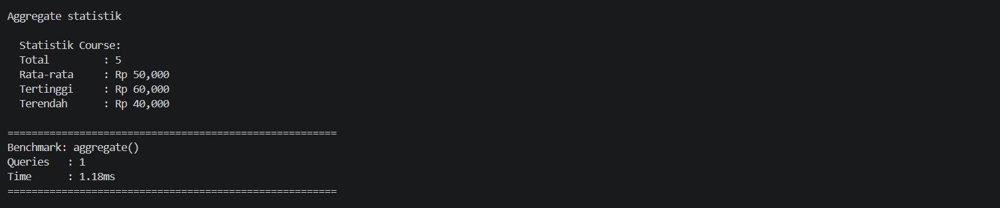

### 8. Django Silk — Query Profiling

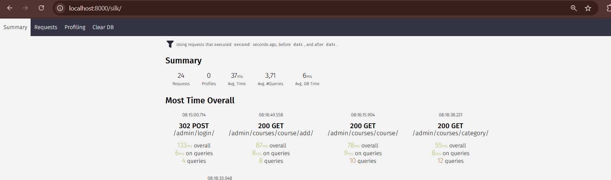

---